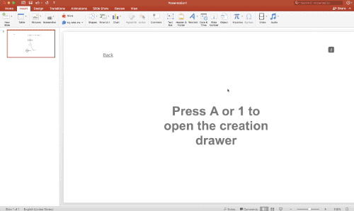
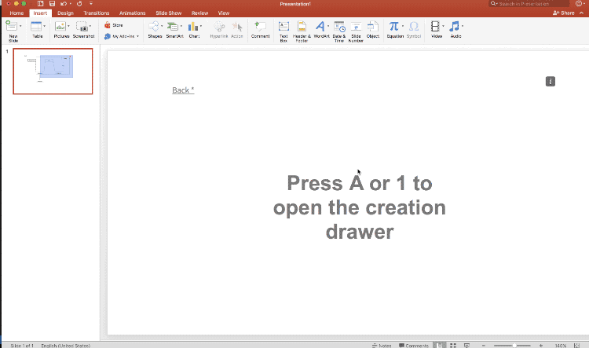
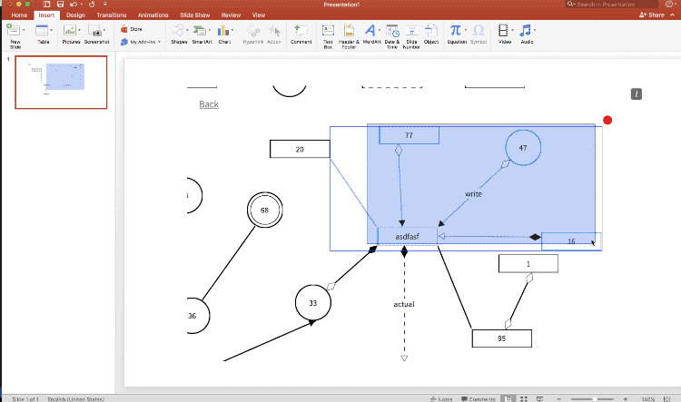
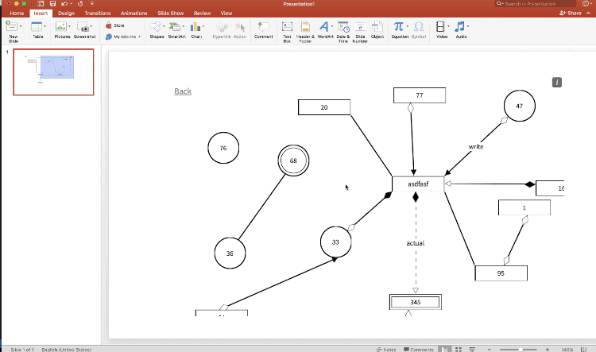

# Type Diagram
Type Diagram (a.k.a _Box Chart_) is a digaramming tool provided as an Office Add-in. Here's the [Youtube trailer](https://www.youtube.com/watch?v=VBiDAGlPD0k)

 ## An Office add in
Type diagram is both intuitive and fast. Like really fast. Like "create binary tree in mere seconds fast".  Type Diagram was built with the understanding that using existing diagramming solutions takes just too long. 

By design, you get to choose one of two shapes that you create from: Rectangle or Circle (more shapes coming soon). Think of these shapes as nodes in your graph. Which means they can be connected via edges. You can write on your nodes and edges but what really makes this super flexibly is that all nodes and edges are mutable, meaning you can change any property of a node while still retaining its content and connections. You can change a node's shape, outline and content. 

Similarly for an edge, you can change arrowheads for its endpoints, its label and its dashing. You can create new conneted nodes by simply selecting a node and clicking on its _linking_ endpoint.

Select multiple nodes together to move (or delete them). Press shift to make more precise selections

Since your diagrams can crossover the bounds of the add in, you can hold space and drag to pan

On top of this Type Diagram provides several other useful features like autosaving, undo-redo, multiple selection, ghost nodes, auto generated node content, edge endpoint preference and common sense hotkeys.
With the idea of a better user experience, I hope that this tool empowers diagrammers everywhere.

### Status 
I will be launching this Add-in soon. If you are interested, please star this project. Thanks

### Instructions for running

1. Make sure you have node installed (check with node -v)
2. __npm install__
3. __npm start__ (or alternatively, if gulp is installed globally : _gulp run:server_ and _gulp run:client_ in 2 separate terminal windows)
4. The very first run may lead to some errors (because of fresh typescript transpiling).
 Thats okay, running second time onwards will work fine.

## [Vote for me](https://devpost.com/software/type-diagram)

Type Diagram was submitted in Microsoft's HackProductivity 2017. If you think this tool will be useful for someone, you can [vote for me](https://devpost.com/software/type-diagram) for the popular choice award.